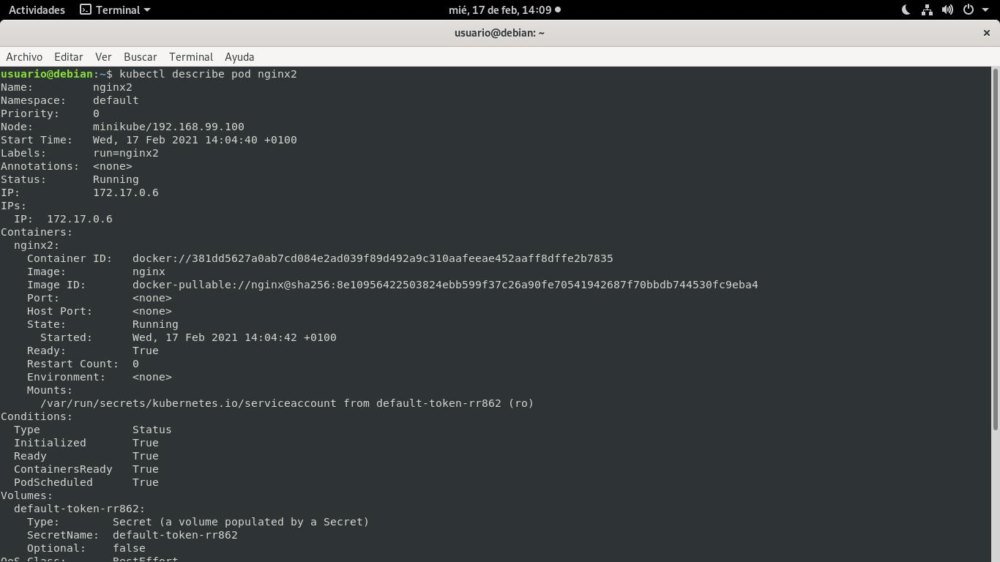
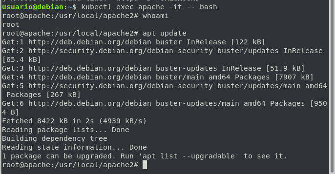
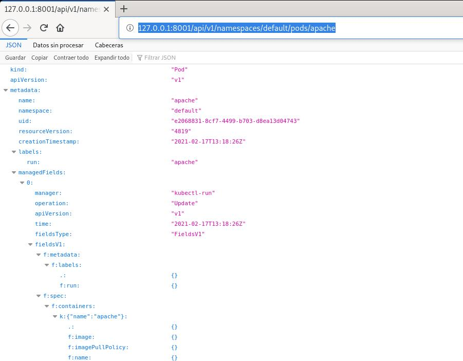

# Pods de forma imperativa

## Práctica 1:  Crear pods de forma imperativa: nginx1 y nginx2

### Levantamos el pods
```bash
kubectl run nginx1 --image=nginx
```


### Estado del pod
```bash
kubectl get pods
```


### Levantamos un segundo pod
```bash
kubectl run nginx2 --image=nginx
```

### Estado del pod
```bash
kubectl get pods
```


### Información detallada del pod
```bash
kubectl describe pod nginx2
```



### Ejecutar un comando dentro del pod

```bash
kubectl exec nginx2 -- ls
```
### Ejecutar un comando de manera interactiva en un contenedor de un pod

```bash
kubectl exec nginx2 -it -- bash
```


### Práctica 2:  Crear un pod que contenga un servidor apache.

### Levantamos el pods

```bash
kubectl run apache --image=httpd
```

### Ver logs

```bash
kubectl logs apache
```

### Estado del pod
```bash
kubectl get pods
```

### Ejecutar un comando de manera interactiva en un contenedor de un pod

```bash
kubectl exec apache -it -- bash
```



### Acceso a la web

```bash
curl localhost
```


## Práctica 3:  Comprobar el clúster con kubectl proxy

### Establecer una conexion con kubernetes

```bash
kubectl proxy
```

### Estado de kubernetes

```bash
firefox http://127.0.0.1:8001/healthz
```

### APIS

```bash
http://127.0.0.1:8001/api/v1/namespaces/default
```


### PODS

```bash
http://127.0.0.1:8001/api/v1/namespaces/default/pods
```


### POD de apache

```bash
http://127.0.0.1:8001/api/v1/namespaces/default/pods/apache
```



## OTROS APUNTES

### Acceso al cluster

```bash
minikube ssh
# Dentro docker ps
```

