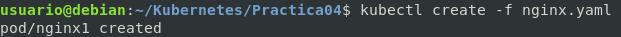
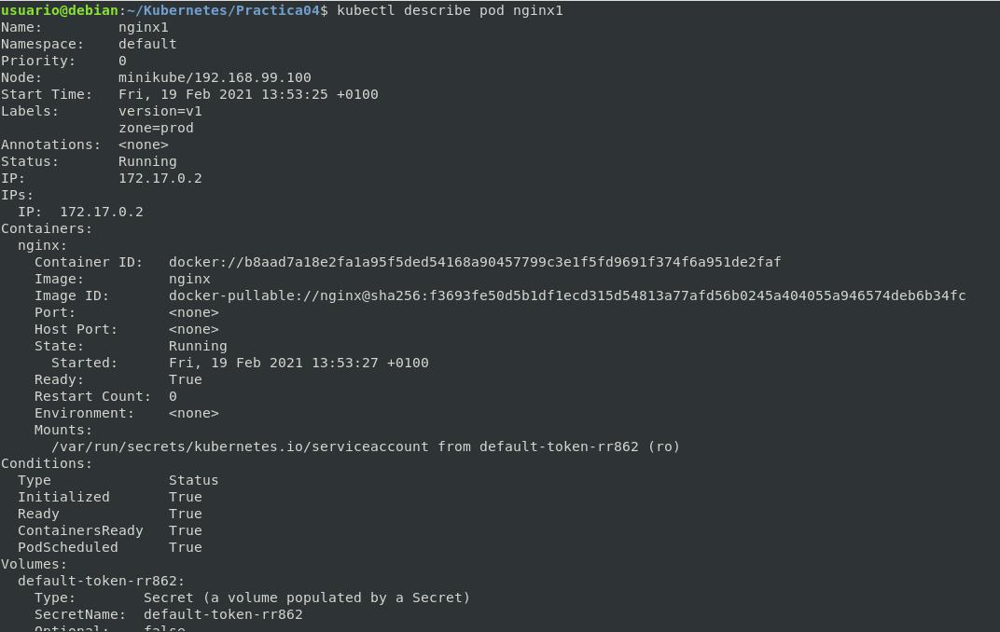

# Pods - YAML

## Práctica 1: Despliegue de aplicaciones a partir de un fichero.

### Nginx

```yml
apiVersion: v1 #Indicamos la versión
kind: Pod # El tipo de componente que queremos crear
metadata:
  name: nginx1 # El nombre del pod
  labels: #Definimos una serie de etiquetas
    zone: prod 
    version: v1
spec: # Las especificaciones (Las características deseables de este pod)
  containers:
   - name: nginx #El nombre del contenedor  
     image: nginx #Indicamos la imagen
```

[Clic descargar YAML](Prac04Nginx.yaml)

### Nos creamos una carpeta

```bash
mkdir kubernetes
```

### Creamos nuestro fichero yaml (clave: valor)

```bash
cat Prac04Nginx.yaml
```

### Levantamos el pods

```bash
kubectl create -f nginx.yaml
```



### Ver el pod

```bash
kubectl get pods
```

### Ver detalle el pod

```bash
kubectl describe pod nginx1
```



### Acceso con el proxy activo


```bash
kubectl proxy
firefox http://127.0.0.1:8001/api/v1/namespaces/default/pods/nginx1/proxy/
```

### Exportar YAML del POD

```bash
kubectl get pod nginx1 -o yaml
# EN json
kubectl get pod nginx1 -o json

```

[Clic descargar YAML exportado](P04FicheroYaml.md)


