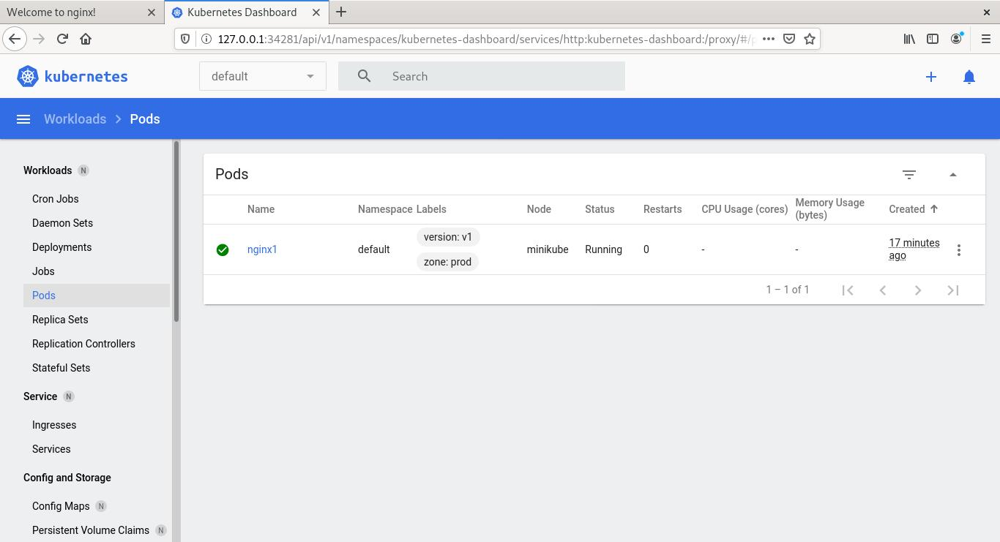

# Pods - Dashboard

## Práctica 1:

### Accedemos al Dashboard.

```bash
firefox 127.0.0.1:EL_PUERTO
```

### Podemos acceder a nodos

```bash
minikube dashboard
```


__________________________________________________

[Volver al índice](../../README.md)