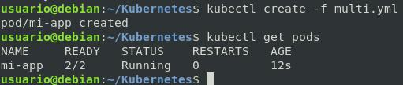
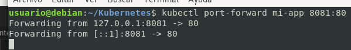
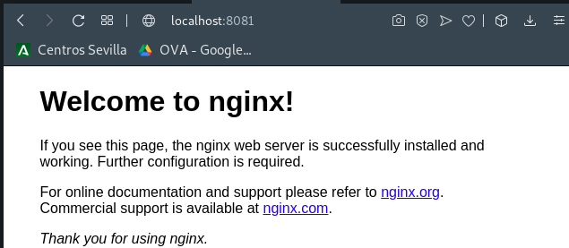

# Pods - Multicontenedores

```yml
apiVersion: v1 # La versión
kind: Pod # Tipo de objeto
metadata: # Metadatos
  name: mi-app
  labels:
    app: web
spec: # Describe el estado ideal de nuestro objeto
  containers:
    - name: frontal
      image: nginx
      ports:
        - containerPort: 80
    - name: almacen
      image: redis
      ports:
        - containerPort: 6379
```

[Clic descargar YAML](multi.yml)

## Levantamos el Pod

```bash
kubectl create -f multi.yml
```



## Ver estado detallado

```bash
kubectl describe pod mi-app
```

*Observar las caracteristicas definidas en el YAML*

*Ver eventos*

## Ver logs de un contenedor de un pod

```bash
kubectl logs mi-app -c almacen
#kubectl logs pod -c contenedor-del-pod
```

## Acceder a un contenedor de un pod

```bash
kubectl exec mi-app -c frontal -it -- bash
#kubectl exec POD -c NOMBRE-CONTENEDOR -it -- bash
```
## Exponer un POD en localhost(Ver Web)

```bash
kubectl port-forward mi-app 8081:80
#kubectl exec POD -c NOMBRE-CONTENEDOR -it -- bash
```




__________________________________________________

[Volver al índice](../../README.md)