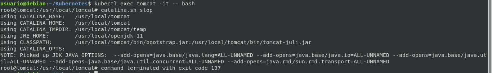
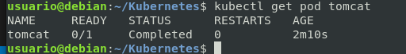
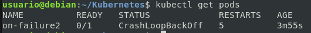
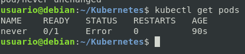

# Pods - Reinicios

> LOS YAML ESTAN EN ESTA REPO

> Por defecto la politica de Kubernetes intentará reinciar el pod

## Práctica 1:  La opción: Allways
### Utilizaremos el archivo restart-always.yml

```bash
kubectl apply -f restart-always.yaml
kubectl describe pod tomcat # Ver que hay 0 reinicios
```

```bash
kubectl apply -f restart-always.yaml
kubectl describe pod tomcat # Ver que hay 0 reinicios
```

*Paramos el servicio desde dentro simulando un error*

```bash
kubectl exec tomcat -it -- bash
```


```bash
kubectl describe pod tomcat # Ver que hay 1 reinicios
```

*Automaticamente Kubernetes reinicia*

## Práctica 2:  La opción: Onfailure

```bash
kubectl apply -f restart-onfailure.yaml
kubectl describe pod tomcat # Ver que hay 0 reinicios
kubectl get pods # Ver que hay 0 reinicios
```

```bash
kubectl apply -f restart-always.yaml
kubectl describe pod tomcat # Ver que hay 0 reinicios
```

*Paramos el servicio desde dentro simulando un error*

```bash
kubectl exec tomcat -it -- bash
```


```bash
kubectl describe pod tomcat # Ver que hay 0 reinicios
kubectl get pods # Ver que hay 0 reinicios
```



*No reinicia el pod por que no es un ERROR*

## Práctica 3:  La opción: OnFailure2

```yml
apiVersion: v1
kind: Pod
metadata:
  name: on-failure2
  labels:
    app: app1
spec:
  containers:
  - name: never
    image: busybox # Imagen
    # Ejecutamos un comando. Saca en pantalla un mensaje y se sale.
    command: ['sh', '-c', 'echo Ejemplo de pod fallado  && exit 1']
  restartPolicy: OnFailure
```

```bash
kubectl apply -f restart-onfailure-2.yaml
kubectl describe pod tomcat # Ver que hay 0 reinicios
```

*El yaml lleva un comando que dará error constantemente*

```bash
kubectl exec tomcat -it -- bash
```


```bash
kubectl describe pod tomcat # Ver que hay muchos reinicios
```



*Automaticamente Kubernetes reinicia pero no logra arrancarlo*

## Práctica 4:  La opción: Never

```yml
apiVersion: v1
kind: Pod
metadata:
  name: tomcat
  labels:
    app: tomcat
spec:
  containers:
   - name: tomcat
     image: tomcat
  restartPolicy: Always # No haría falta porque es predeterminada
```

```bash
kubectl apply -f restart-never.yaml
kubectl describe pod tomcat # Ver que hay 0 reinicios
```

*El yaml lleva un comando que dará error constantemente*

```bash
kubectl exec tomcat -it -- bash
```


```bash
kubectl describe pod tomcat # Ver que sigue habiendo 0 reinicios
```



*No reinicia los pods NUNCA*