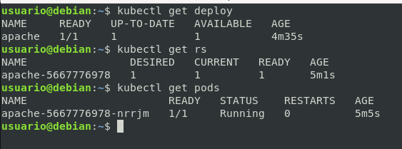
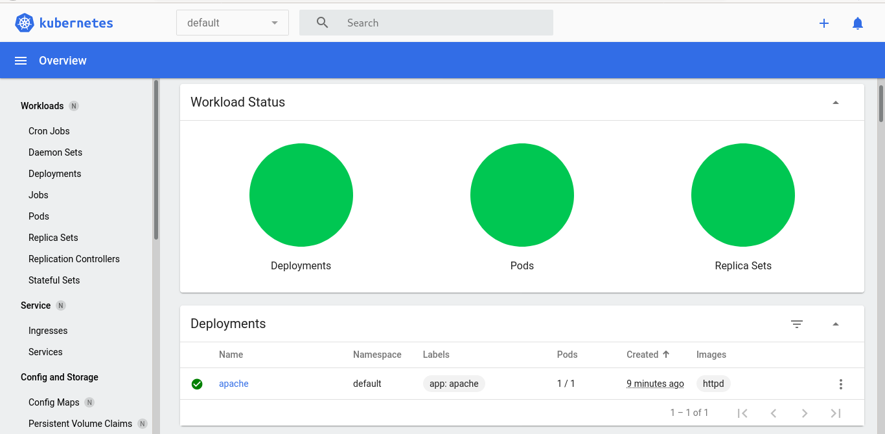
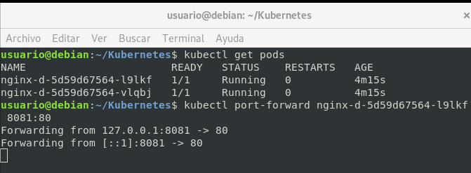

# Deployments de Forma Imperativa

## Crear Deployment

```bash
kubectl create deployment apache --image=httpd
```

## Crear Deployment

```bash
kubectl create deployment apache --image=httpd
```

## Ver deployment > Replica > pods 

```bash
kubectl get deploy -o wide # Ver Deploy
kubectl get rs -o wide # Ver Replica Set
kubectl get pods -o wide # Ver Pods
kubectl get deploy,rs,pods
```



## Ver desde el dashboard de minikube deployment > Replica > pods 

```bash
minikube dashboard
```



## Ver desde el Navegador abriendo puertos

```bash
kubectl get pods -o wide
kubectl port-forward apache-5667776978-n 8081:80
```



## Borrar deploy 

**-->Se borra tanto el deploy como el pods como el replica set<--**

```bash
kubectl get  pods
kubectl delete deploy apache
# kubectl delete pod nginx-d-5d59d67564-vlqbj #Borrar pod
kubectl get  pods 
# IMPORTANTE Ver el tiempo que lleva iniciado el que hemos borrado
kubectl get  pods
```

