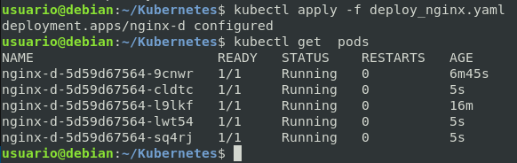
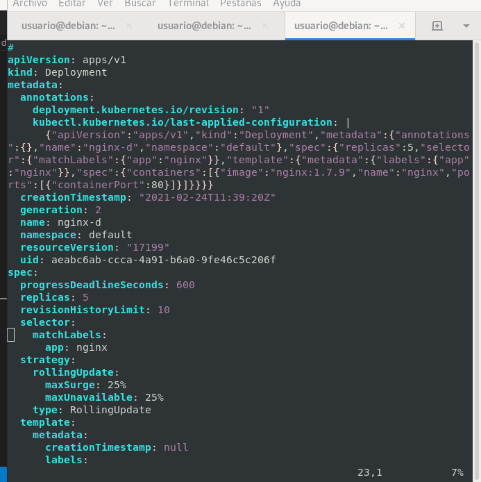
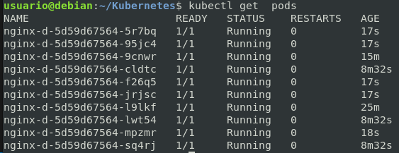

# Deployments de Forma Decalarativa y Escalado


## Práctica 1:  Crear un deployment a partir de un fichero

*YAML...*

```yml
apiVersion: apps/v1 # i se Usa apps/v1beta2 para versiones anteriores a 1.9.0
kind: Deployment
metadata:
  name: nginx-d
spec:
  selector:   #permite seleccionar un conjunto de objetos que cumplan las condicione
    matchLabels:
      app: nginx
  replicas: 2 # indica al controlador que ejecute 2 pods
  template:   # Plantilla que define los containers
    metadata:
      labels:
        app: nginx
    spec:
      containers:
      - name: nginx
        image: nginx:1.7.9
        ports:
        - containerPort: 80
```

## Crear Deployment
```bash
kubectl apply -f deploy_nginx.yaml
```

## Ver deployment > Replica > pods 

```bash
kubectl get deploy -o wide
kubectl get rs -o wide
kubectl get pods -o wide
kubectl get deploy,rs,pods
```

## Ver desde el Navegador abriendo puertos 

```bash
kubectl get pods -o wide
kubectl port-forward nginx-d-5d59d67564-l9lkf 8081:80
```

## Borrar pods del deploy 

```bash
kubectl get pods -o wide
kubectl delete pod nginx-d-5d59d67564-vlqbj
# Ver el tiempo que lleva iniciado el que hemos borrado
```


## Modificar numero de replicas en caliente deploy

*Cambiar YAML para hacer 3 réplicas:*

*YAML...*

```yml
apiVersion: apps/v1 # i se Usa apps/v1beta2 para versiones anteriores a 1.9.0
kind: Deployment
metadata:
  name: nginx-d
spec:
  selector:   #permite seleccionar un conjunto de objetos que cumplan las condicione
    matchLabels:
      app: nginx
  replicas: 3 # indica al controlador que ejecute 3 pods
  template:   # Plantilla que define los containers
    metadata:
      labels:
        app: nginx
    spec:
      containers:
      - name: nginx
        image: nginx:1.7.9
        ports:
        - containerPort: 80
```

```bash
kubectl apply -f deploy_nginx.yaml
kubectl get  pods
# Ver el tiempo que lleva iniciado el que hemos borrado
```



## Modificar numero de replicas --> SIN YAML <-- EN CALIENTE deploy

```bash
kubectl get pods deploys
kubectl edit deploy nginx-d
kubectl get pods
# Ver el tiempo que lleva iniciado
```






## Escalar MANUALMENTE --> CON COMANDO <--

```bash
kubectl scale deploy nginx-d --replicas=15
kubectl get  pods
# Ver el tiempo que lleva iniciado
```

## Escalar MANUALMENTE HACIA ABAJO REDUCIR --> CON COMANDO <--

```bash
kubectl scale deploy nginx-d --replicas=4
kubectl get  pods #Ver pods
# Ver el tiempo que lleva iniciado
```

<!-- *Probar otras las otras formas* -->
