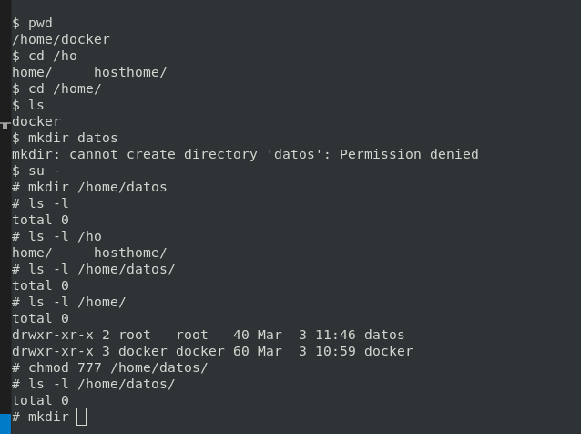

## Práctica 0: Dejamos limpio el entorno.
>**Borrar en orden de creación**

```bash
kubectl get deploy,pods,svc
kubectl delete svc web-svc
kubectl delete deploy nginx-d
kubectl get deploy,pods,rs
kubectl get deploy,pods,svc
```

## Práctica 1: CREACIÓN DE UN VOLUMEN EN UN POD (Crear Pod)

```yml
apiVersion: v1
kind: Pod
metadata:
  name: volumenes
spec:
  containers:
  - name: nginx
    image: nginx
    volumeMounts:
    - mountPath: /datos
      name: datos
    - mountPath: /git
      name: git
      readOnly: true
    - mountPath: /temp
      name: temp
  volumes:
  - name: datos
    hostPath:
      path: /home/datos
  - name: git
    gitRepo:
      repository: https://github.com/mftienda/PowerShellAdministradores.git
  - name: temp
    emptyDir: {}
```

## Creamos el Directorio

```bash
minikube ssh
```



## Lanzamos el Volumen (Declarativo)

```bash
kubectl apply -f volumen.yaml
```

## Ver volumenes

```bash
kubectl describe pod volumen
```

## Ver puntos de montaje

```bash
kubectl exec -it volumenes -- bash
```


## Borramos el pod

```bash
kubectl get pods
kubectl delete pod volumenes
```

## Lanzamos el Volumen de nuevo
> Deben seguir estando los datos dentro del nuevo Pod

```bash
kubectl apply -f volumen.yaml
```