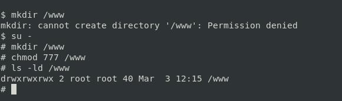

## Práctica 0: Dejamos limpio el entorno.

## Práctica 1:  CREACIÓN DE UN VOLUMEN  EN UN POD

## Partimos del archivo: 01-pod.yaml

```yml
apiVersion: v1
kind: Pod
metadata:
  name: nginx-01
  labels:
    app: nginx
spec:
  containers:
  - image: nginx
    name: nginx
    volumeMounts:
    - mountPath: /usr/share/nginx/html
      name: www-volume

  volumes:
  - name: www-volume
    hostPath:
      # directory location on host
      path: /www
      # this field is optional
      type: Directory
```



```bash
kubectl apply -f 01-pod.yaml
```

## Ahora creamos otro pod apuntando al mismo volumen.
## Partimos del archivo: 02-pod.yaml

```yml
apiVersion: v1
kind: Pod
metadata:
  name: nginx-02
  labels:
    app: nginx
spec:
  containers:
  - image: nginx
    name: nginx
    volumeMounts:
    - mountPath: /usr/share/nginx/html
      name: www-volume

  volumes:
  - name: www-volume
    hostPath:
      # directory location on host
      path: /www
      # this field is optional
      type: Directory
```

## Lanzamos el servicio (Para poder acceder desde el exterior)

```bash
kubectl apply -f 03-service-node-port.yaml 
```

*El YAML...*

```yml
apiVersion: v1
kind: Service
metadata:
  name: nginx
spec:
  type: NodePort
  ports:
  - port: 80
    targetPort: 80
    nodePort: 30000
  selector:
    app: nginx
```

## Accedemos con la ip del cluster y el puerto

```bash
firefox 192.168.99.100:30000
curl 192.168.99.100:30000
```

## UTILIDAD DE ADICIONAL DE KUBERNETES

[*GitHub para la descarga oficial*](https://github.com/FJmonge00/HerramientasKubernetes_SRI/blob/master/practicas/practica23/stern)

```bash
wget https://github.com/FJmonge00/HerramientasKubernetes_SRI/blob/master/practicas/practica23/stern
```

```bash
cp /home/$USER/Kubernetes/stern /usr/local/bin/
chown $USER:$USER /usr/local/bin/stern
chmod +x /usr/local/bin/stern
```

## Práctica 3:  BALANCEO DE CARGA

```bash
stern -s 1m nginx
curl 192.168.99.100:30000;curl 192.168.99.100:30000;curl 192.168.99.100:30000;curl 192.168.99.100:30000;curl 192.168.99.100:30000;curl 192.168.99.100:30000
```

